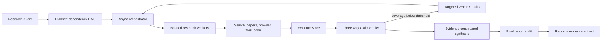

<div align="center">

# YuResearchAgent

### Evidence-grounded multi-agent deep research

[](https://python.org)
[](pyproject.toml)
[](tests/unit)
[](https://github.com/yuyu0529nya/YuResearchAgent/actions/workflows/ci.yml)
[](LICENSE)

</div>

YuResearchAgent is a long-form research system in which citations are runtime
data, not post-processing decoration. It decomposes a question into a dependency
DAG, executes tool-using workers concurrently, records retrieved material in a
typed Claim-Evidence-Source graph, identifies unsupported claims, and synthesizes
a report under an explicit global time budget.

The default model is **Kimi Code K3** through its OpenAI-compatible endpoint.
Zero-key retrieval cascades through Yahoo, Brave, and Wikipedia; scholarly
metadata cascades through OpenAlex and Crossref. The browser can extract arXiv
HTML or PDF full text rather than treating an abstract as a complete paper.

## Technical Core

- **Typed EvidenceGraph**: stable SHA-256-derived IDs connect report claims to
  exact evidence chunks and normalized source records. Verdicts are
  `SUPPORTED`, `REFUTED`, or `NOT_ENOUGH_EVIDENCE`.
- **Gap-driven retrieval**: low evidence coverage becomes bounded `VERIFY`
  tasks prioritized by contradiction, numeric specificity, and uncertainty.
- **Strict hybrid verification**: deterministic lexical, numeric, source-quality,
  and polarity checks are followed by batched LLM entailment checks only for
  ambiguous pairs. Compound claims require every material clause to be supported.
- **Evidence-constrained synthesis**: the writer receives source title, authors,
  year, URL, source ID, and claim verdicts; it must use mapped `[N]` citations and
  generate a normalized bibliography.
- **Long-horizon runtime**: a 9-state async orchestrator provides DAG scheduling,
  worker isolation, bounded retries, replanning, partial-report fallback, and
  separate reserves for synthesis and final audit.
- **Auditable evaluation**: paired generation, exact report retention, SHA-256
  integrity checks, counterbalanced LLM-as-Judge, bootstrap intervals, effect
  sizes, token/latency telemetry, resume-safe checkpoints, and real config ablations.
- **Streaming observability**: the Gradio UI exposes run state, tool events,
  evidence coverage, unresolved claims, and high-value sources as research runs.

## Architecture



| Layer | Implementation |
|---|---|
| Orchestration | DAG layers, `asyncio`, bounded concurrency, retries, replan, hard deadline |
| Retrieval | Yahoo/Brave/Wikipedia, OpenAlex/Crossref, arXiv HTML/PDF, files, calculator, sandbox |
| Evidence | typed schemas, canonical URLs, source dedupe, hashes, claim attribution edges |
| Verification | lexical/numeric/polarity pass plus strict, source-bounded LLM entailment |
| Context | feature-hash fallback, query-biased filtering, TextRank, hierarchical summary |
| Synthesis | structured source catalog, verdict constraints, normalized references, final audit |
| Evaluation | rule metrics, balanced Judge sampling, paired statistics, executable ablations |

## Paper-Grounded Design

The project adapts research ideas without claiming paper-equivalent reproduction:

| Research idea | Concrete implementation | Boundary |
|---|---|---|
| [CAGE: Cognitive Attribution Graphs](https://arxiv.org/abs/2607.24236) | explicit Claim-Evidence-Source graph and citation alignment | independent graph implementation; no CAGE model training |
| [WebWeaver](https://arxiv.org/abs/2509.13312) | evidence acquisition followed by coverage-triggered plan expansion | no learned dynamic-outline controller |
| [A-RAG](https://arxiv.org/abs/2602.03442) | search, paper metadata, full-text reading, chunk-level verification | no learned retrieval policy |
| [FS-Researcher](https://arxiv.org/abs/2602.01566) | persistent SQLite memory and hashed evidence artifacts | not a full file-system agent |
| [ReSum](https://arxiv.org/abs/2509.13313) | budget-triggered multilevel context compression | no periodic ReSum-GRPO policy update |
| [DeepResearch Bench II](https://arxiv.org/abs/2601.08536) | atomic claim diagnosis and separate rule/Judge layers | local suite is not benchmark-equivalent |

The exact algorithm-to-code mapping is documented in
[docs/ALGORITHMS.md](docs/ALGORITHMS.md). The
[artifact index](docs/evaluation/README.md) labels every retained result by
evidence level.

## Reproducible Evidence

### Real Kimi K3 Run And Evidence Replay

A live run on 2026-08-13 queried first-party Qwen2.5 technical reports through
Kimi K3, keyless scholarly retrieval, PDF extraction, synthesis, and final audit.

| Runtime measure | Result |
|---|---:|
| Run status | complete |
| API calls / total tokens | 11 / 41,267 |
| Search calls | 3 |
| Sources / evidence chunks | 3 / 15 |
| Primary-source ratio | 100% |
| Full-text-source ratio | 33.3% |
| Wall time | 352.76 s |

The exact [report](docs/evaluation/artifacts/evidence_v2/qwen25_agent.md) and
[evidence graph](docs/evaluation/artifacts/evidence_v2/qwen25_evidence.json) are
committed. Replaying the current verifier over those immutable inputs produces:

| Audit mode | Supported | Unresolved | Coverage | API calls |
|---|---:|---:|---:|---:|
| deterministic heuristic | 3/30 | 27/30 | 10.0% | 0 |
| independent hybrid Judge | 13/30 | 17/30 | 43.3% | 3 |

The low heuristic score is intentional: Chinese claims do not receive semantic
credit from English evidence by string proximity alone. The hybrid pass can
resolve cross-language entailment, while unsupported compound claims remain NEI.
Both complete replay artifacts are retained under
[docs/evaluation/artifacts/evidence_v2](docs/evaluation/artifacts/evidence_v2).
The [runtime manifest](docs/evaluation/artifacts/evidence_v2/runtime_manifest.json)
pins every input and replay hash. This is a runtime and verifier test, not a
population-level quality benchmark.

### Corrected Head-To-Head Development Pilot

The current v3 protocol compares the same base model on the same question:
full Agent versus one Kimi K3 call, with exact reports and two counterbalanced
DeepSeek Judge presentation orders.

| n=1 development result | Agent | One-call baseline | Delta |
|---|---:|---:|---:|
| ResearchBench v2 rule composite | 0.7182 | 0.6430 | +0.0753 |
| Counterbalanced Judge mean, 1-5 | 4.50 | 3.25 | +1.25 |
| Wall time | 447.70 s | 52.04 s | +395.66 s |
| API tokens | 54,305 | 1,739 | +52,566 |

With one pair, significance is undefined for practical purposes; the artifact
therefore reports `p=1.0`, `method=insufficient_n`, and makes no general lift
claim. Reports, evidence, hashes, telemetry, and raw Judge verdicts are in the
[v3 pilot artifact](docs/evaluation/artifacts/headtohead_v3/headtohead_v3_pilot.json).

### Real Module Ablation Diagnostic

The executable `full` versus `no_evidence` smoke ablation did **not** show a
quality gain on its one question: rule composite `0.7289` versus `0.7405`, while
the full system used 25,027 more tokens and 103.76 more seconds. This is retained
as a negative result, not hidden as a successful ablation. The run predates the
latest full-text and verifier fixes and is only a development diagnostic.
[Exact artifact and reports](docs/evaluation/artifacts/ablation_v3/ablation_v3_smoke.json).

### Evaluation Integrity Correction

An older n=15 artifact reported a significant gain, but audit found that a metric
name mismatch silently removed the intended 25% factuality weight. It is marked
`superseded_pending_rerun`; its compact reports were insufficient to recompute
the corrected score. ResearchBench v2 now emits canonical factual accuracy and
stores its metric contract in every artifact. See
[docs/EXPERIMENTS.md](docs/EXPERIMENTS.md).

### Citation And GRPO Studies

- A fixed citation-development case moved from `4/10` to `7/10` after source
  title/author/year/URL metadata was made available to synthesis. It is labeled
  a development trace, not a general benchmark.
- Four real TRL + LoRA + GRPO runs covered Qwen2.5 7B/1.5B instruct and 1.5B base.
  Small held-out improvements were not statistically significant; higher train
  reward did not improve one held-out result. The value is the complete training
  pipeline and the documented negative finding, not an inflated capability claim.

Artifacts: [citation trace](docs/evaluation/citation_quality_v3.json),
[GRPO manifest](docs/evaluation/grpo_runs.json), and
[training summary](scripts/grpo_poc/SUMMARY.md).

## Quick Start

```bash
git clone https://github.com/yuyu0529nya/YuResearchAgent.git
cd YuResearchAgent

python3 -m venv .venv
source .venv/bin/activate
pip install -r requirements.txt

cp .env.template .env.local
# Set KIMI_API_KEY in .env.local. Never commit this file.
```

Run one query:

```bash
python scripts/run_single.py \
  --query "对比 2025-2026 年深度研究 Agent 的证据归因方法" \
  --config configs/default.yaml
```

Start the streaming UI:

```bash
python scripts/run_webui.py
# http://127.0.0.1:7860
```

Optional heavy features are explicit: `pip install -e '.[web]'` for Gradio,
`.[semantic]` for sentence-transformers, `.[analysis]` for evaluation analysis,
and `.[train]` for TRL/LoRA. The default core path does not install Torch.

## Evaluation Workflows

Run the API-free suite:

```bash
pip install -r requirements-test.txt
pytest tests/unit -q
```

Run the corrected, resume-safe paired protocol:

```bash
python scripts/run_headtohead.py \
  --num_questions 15 \
  --judge_backend deepseek \
  --output outputs/evaluation/headtohead_v3.json
```

Replay an exact report/evidence pair without an LLM:

```bash
python scripts/replay_evidence.py \
  --report docs/evaluation/artifacts/evidence_v2/qwen25_agent.md \
  --evidence docs/evaluation/artifacts/evidence_v2/qwen25_evidence.json \
  --output outputs/evaluation/evidence_replay.json
```

Add `--verifier-backend deepseek` for source-bounded semantic verification.

## Configuration

Core switches live in [configs/default.yaml](configs/default.yaml):

```yaml
orchestrator:
  max_concurrent: 2
  global_timeout_seconds: 480
  synthesis_reserve_seconds: 110
  final_audit_reserve_seconds: 35

evidence:
  enabled: true
  verification_mode: hybrid
  min_coverage: 0.55
  max_gap_rounds: 1
  max_gap_tasks: 2
```

`memory.enabled`, `compressor.enable_multilevel`, `planner.enable_replan`,
`planner.enable_completeness_check`, and `evidence.enabled` are executable
ablation switches. Red-Blue review is disabled by default because retained A/B
evidence did not establish a quality gain.

## Reliability

- Independent mutable model policies prevent worker tool schemas and truncation
  flags from leaking across concurrent trajectories.
- Every network tool has a bounded timeout and returns a recoverable observation;
  completed work survives global timeout or synthesis failure as a partial report.
- Search snippets, abstracts, and full text remain distinct evidence types;
  browser errors cannot become evidence.
- arXiv PDF/HTML URLs and versions canonicalize to one source; DOI URLs receive
  equivalent normalization.
- Exact reports and evidence graphs are retained with integrity hashes; resume
  rejects missing or modified report artifacts.
- Long Judge inputs use balanced beginning/middle/end/bibliography sampling, and
  A/B ordering is counterbalanced.
- `242` API-free unit tests cover orchestration, parsing, retrieval, evidence,
  metrics, replay integrity, provider compatibility, and regressions. CI runs on
  Python 3.10, 3.11, 3.12, and 3.13.

## Repository Layout

```text
YuResearchAgent/
├── configs/                  # runtime and module configuration
├── src/
│   ├── orchestrator/         # state machine, DAG execution, AgentPool
│   ├── evidence/             # typed store, verifier, gap planner
│   ├── planner/              # planning and replanning
│   ├── agents/               # researcher and constrained synthesizer
│   ├── tools/                # search, papers, browser, files, code
│   ├── compressor/           # multilevel long-context control
│   ├── memory/               # scoped SQLite/vector memory
│   └── models/               # OpenAI-compatible backend router
├── evaluation/               # benchmark contracts, metrics, Judge, statistics
├── scripts/                  # CLI, UI, evaluation, replay, GRPO PoC
├── docs/                     # algorithm mapping and experiment ledger
└── tests/unit/               # deterministic API-free suite
```

## Current Boundary

The engineering system is complete enough to run and audit, but the strongest
scientific claim is still pending: a corrected, report-retaining n=15 rerun has
not yet established that multi-agent execution beats the one-call baseline.
The repository treats that as the next experiment rather than reusing an invalid
historical significance result.

## License

[MIT](LICENSE) © 2025 YuResearchAgent Contributors.
